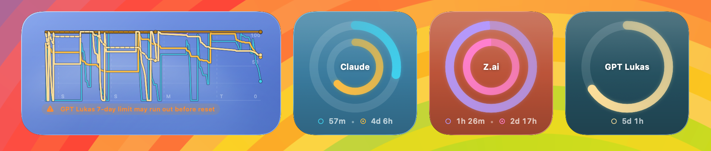
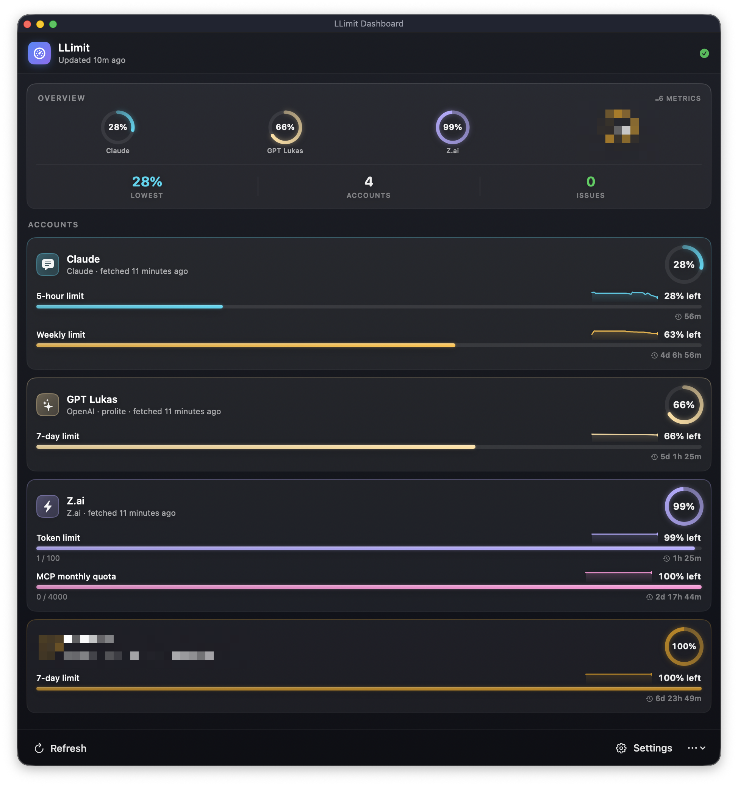

# LLimit

**LLimit** is a self-contained macOS menu-bar app + desktop widgets that track how
much of your LLM subscription quota is left.



You manage your accounts **inside LLimit** — add as many as you like, including
several accounts for the same provider (e.g. two separate OpenAI accounts), each
tracked independently. LLimit doesn't depend on any other tool being installed.

To make setup painless, LLimit can **optionally detect** logins from AI tools you're
already signed in to (Claude Code, Codex, GitHub Copilot, OpenCode) and import them
into a new account with one click — so for the common case you never hunt for a
token. You can always add accounts manually too.



## Supported providers

| Provider | Credential it needs | One-click import from |
| --- | --- | --- |
| **Claude** (Anthropic) | OAuth access token | Claude Code (Keychain / `~/.claude/.credentials.json`), OpenCode |
| **OpenAI / ChatGPT** | ChatGPT OAuth access token (+ account id) | Codex CLI (`~/.codex/auth.json`), OpenCode |
| **GitHub Copilot** | OAuth token, or PAT + username | `~/.config/github-copilot`, `~/.copilot`, OpenCode |
| **Zhipu AI** | API key | OpenCode (`zhipuai-coding-plan`) |
| **Z.ai** | API key | OpenCode (`zai-coding-plan`) |
| **Kimi** (Moonshot AI) | API key or OAuth access token | Kimi CLI (`~/.kimi`), Kimi Code (`~/.kimi-code`) |
| **Google (Antigravity)** | Refresh token + project id | OpenCode (`antigravity-accounts.json`) |

## How accounts work

- **Settings → Accounts** is where you add/rename/enable/remove accounts and enter
  credentials. Add the same provider multiple times for multiple subscriptions.
- **Detected on this Mac** (same tab) lists logins LLimit found locally; click
  **Import** to create a pre-filled account. This is just a shortcut — imported
  accounts are copied into LLimit and stored locally; the source tool can be removed.
- Credentials are stored in LLimit's own settings file
  (`~/Library/Application Support/LLimit/`, mode `600`) and are **redacted before
  anything is shared with the widget** (the widget only ever sees usage numbers).
- Each account can have its own widget styling; the menu bar and widgets show all
  enabled accounts.

## Requirements

- macOS 14+
- Xcode 15+ (only to build; releases run with no Xcode GUI)
- [XcodeGen](https://github.com/yonaskolb/XcodeGen)

## Build & run

```bash
brew install xcodegen      # if needed
xcodegen generate          # or: ./scripts/bootstrap.sh
open LLimit.xcodeproj
```

1. Select your Apple Developer **signing team** for both targets (`LLimit` and
   `LLimitWidgetExtension`). The App Group is `$(TeamIdentifierPrefix)group.ch.lkmc.llimit`.
2. Run the `LLimit` target — it lives in the menu bar (no Dock icon).
3. Add an account (manually or via **Import**), then **Refresh Now**.
4. Add the widget from the desktop / Notification Center gallery.

The first time you import Claude from the Keychain, macOS asks you to allow access —
click **Always Allow**. (To avoid the prompt you can export the token once:
`security find-generic-password -s "Claude Code-credentials" -w > ~/.claude/.credentials.json`.)

## Build & release from the command line (no Xcode GUI)

```bash
./scripts/build.sh                # build LLimit.app (dev-signed so the widget works) + reveal in Finder
./scripts/build.sh --dmg --zip    # also package dist/LLimit-<version>.{dmg,zip}
./scripts/release.sh 0.3.0        # bump version, tag, push -> GitHub Actions publishes the release
```

See [`RELEASING.md`](RELEASING.md) for Developer ID signing + notarization and the
GitHub Actions setup. Pushing a `v*` tag builds and attaches the `.zip`/`.dmg` to a
GitHub Release automatically.

## Why the app isn't sandboxed

The optional import feature reads credential files in your home directory and the
Claude Keychain item, which the App Sandbox blocks (or forces a "grant access" prompt
per file). LLimit is distributed directly rather than through the Mac App Store, so
the host app runs unsandboxed while the **widget extension stays sandboxed** and only
ever reads the shared App Group container. See [`AGENTS.md`](AGENTS.md) for details.

## How it works

1. You configure accounts in LLimit (`QuotaCore.ProviderAccount`). `CredentialDiscovery`
   powers the optional import shortcut.
2. `QuotaCoordinator` fetches usage from each enabled account's provider API in parallel.
3. The result is written as a `QuotaSnapshot` JSON file into the App Group container
   (credentials are never included).
4. `WidgetCenter.reloadTimelines` nudges the widgets, which read the snapshot and render.

The pure-Swift core (`Packages/QuotaCore`) is covered by unit tests:

```bash
cd Packages/QuotaCore && swift test
```
