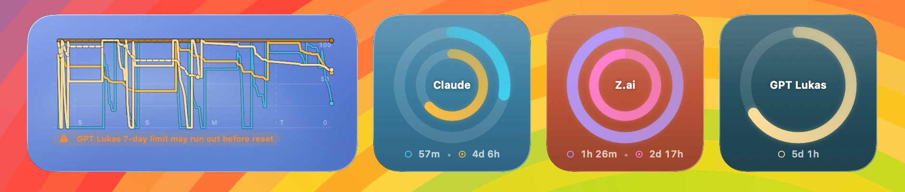
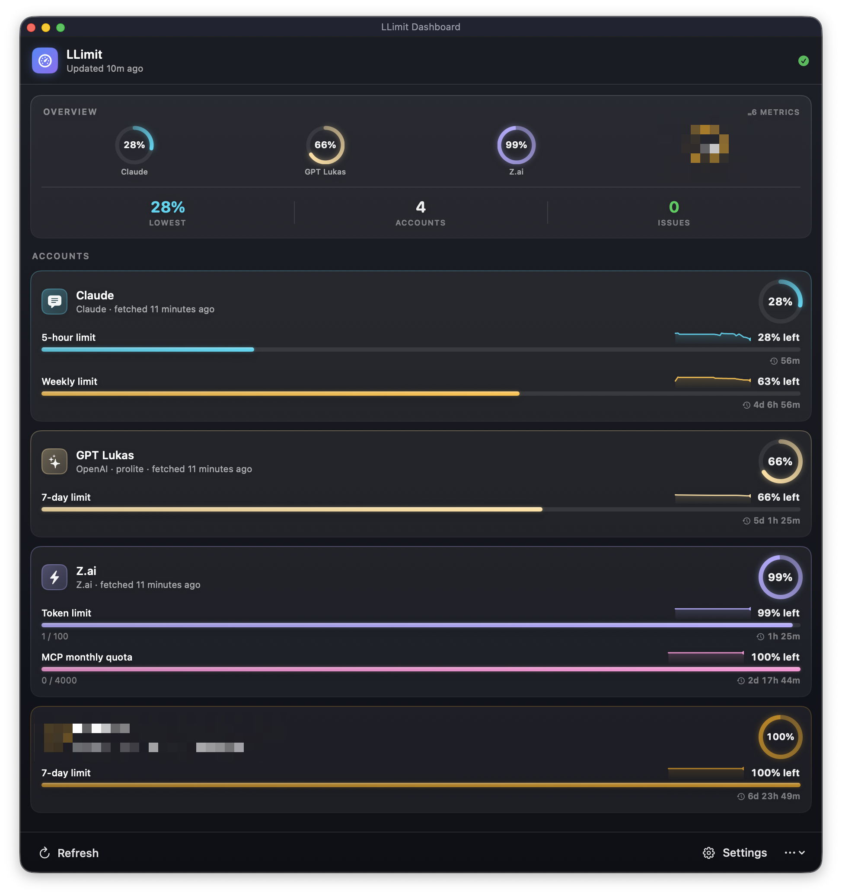

# LLimit

**LLimit** tracks how much of your LLM subscription quota is left:

- **macOS** — a self-contained menu-bar app + desktop widgets.
- **Linux** — a headless `llimit` daemon + CLI, with ready-made status-bar modules
  (waybar, polybar, eww) and a `.deb` package.

**Latest release:** v<!-- version -->1.0.1<!-- /version --> · [Download](https://github.com/L-K-M/LLimit/releases/latest)
(macOS `.dmg`/`.zip` + Linux `llimit_*_amd64.deb`)



You manage your accounts **inside LLimit** — add as many as you like, including
several accounts for the same provider (e.g. two separate OpenAI accounts), each
tracked independently. LLimit doesn't depend on any other tool being installed.

To make setup painless, LLimit can **optionally detect** logins from AI tools you're
already signed in to (Claude Code, Codex, GitHub Copilot, Kimi, OpenCode) and import
them into a new account with one click — so for the common case you never hunt for a
token. You can always add accounts manually too.



## Linux quickstart

```bash
sudo dpkg -i llimit_*_amd64.deb                 # no Swift toolchain needed; static binary
llimit accounts import                          # detect local tool logins, or:
llimit accounts add --provider anthropic        #   add manually (prompts for the token)
systemctl --user enable --now llimit.service    # refresh daemon
llimit status                                   # human-readable
llimit status --json                            # the status-bar contract
```

Then point your bar at `llimit status --json` — drop-in modules for waybar, polybar
and eww live in [`Packages/LLimitd/examples/`](Packages/LLimitd/examples/) (and in
the .deb under `/usr/share/llimit/examples/`):


Everything in depth: [`Packages/LLimitd/README.md`](Packages/LLimitd/README.md).

## Supported providers

The same providers and import sources work on both platforms, with one difference:
the Claude Keychain import is macOS-only — Linux Claude Code writes
`~/.claude/.credentials.json` directly, which LLimit reads on both platforms.

| Provider | Credential it needs | One-click import from |
| --- | --- | --- |
| **Claude** (Anthropic) | OAuth access token | Claude Code (macOS Keychain / `~/.claude/.credentials.json`), OpenCode |
| **OpenAI / ChatGPT** | ChatGPT OAuth access token (+ account id) | Codex CLI (`~/.codex/auth.json`), OpenCode |
| **GitHub Copilot** | OAuth token, or PAT + username | `~/.config/github-copilot`, `~/.copilot`, OpenCode |
| **Zhipu AI** | API key | OpenCode (`zhipuai-coding-plan`) |
| **Z.ai** | API key | OpenCode (`zai-coding-plan`) |
| **Kimi** (Moonshot AI) | API key or OAuth access token | Kimi CLI (`~/.kimi`), Kimi Code (`~/.kimi-code`), OpenCode (`kimi-for-coding`) |
| **Google (Antigravity)** | Refresh token + project id | OpenCode (`antigravity-accounts.json`) |

## How accounts work

- **Settings → Accounts** (macOS) / **`llimit accounts …`** (Linux) is where you
  add/rename/enable/remove accounts and enter credentials. Add the same provider
  multiple times for multiple subscriptions.
- **Detected on this machine** lists logins LLimit found locally; import creates a
  pre-filled account. This is just a shortcut — imported accounts are copied into
  LLimit and stored locally; the source tool can be removed.
- Credentials are stored in LLimit's own settings file (mode `600`;
  `~/Library/Application Support/LLimit/` on macOS, `$XDG_CONFIG_HOME/LLimit/` on
  Linux) and are **redacted before anything is shared** with the widgets or the
  status-bar JSON — those only ever see usage numbers.
- Each account can have its own widget styling on macOS; on Linux the bar module
  shows every enabled account.

## Requirements

**macOS**

- macOS 14+
- Xcode 15+ (only to build; releases run with no Xcode GUI)
- [XcodeGen](https://github.com/yonaskolb/XcodeGen)

**Linux**

- Any x86_64 distro for the release `.deb` (fully static binary; `systemd --user`
  for the daemon units, a bar that can run a command on an interval)
- Swift 6.2+ (only to build from source)

## Build & run (macOS)

```bash
brew install xcodegen      # if needed
xcodegen generate          # or: ./scripts/bootstrap.sh
open LLimit.xcodeproj
```

1. Select your Apple Developer **signing team** for both targets (`LLimit` and
   `LLimitWidgetExtension`). The App Group is `$(TeamIdentifierPrefix)group.ch.lkmc.llimit`.
2. Run the `LLimit` target — it lives in the menu bar (no Dock icon).
3. Add an account (manually or via **Import**), then **Refresh Now**.
4. Add the widget from the desktop / Notification Center gallery.

The first time you import Claude from the Keychain, macOS asks you to allow access —
click **Always Allow**. (To avoid the prompt you can export the token once:
`security find-generic-password -s "Claude Code-credentials" -w > ~/.claude/.credentials.json`.)

## Build & run (Linux)

```bash
swift build --package-path Packages/LLimitd          # produces .build/debug/llimit
Packages/LLimitd/systemd/install.sh                  # binary + daemon unit into ~/.local
```

For the fully static release build and `.deb` packaging, see
[`Packages/LLimitd/README.md`](Packages/LLimitd/README.md#install-from-deb-no-swift-toolchain-needed).

## Build & release from the command line (no Xcode GUI)

```bash
./scripts/build.sh                # build LLimit.app (dev-signed so the widget works) + reveal in Finder
./scripts/build.sh --dmg --zip    # also package dist/LLimit-<version>.{dmg,zip}
./scripts/release.sh 0.3.0        # bump version, tag, push -> GitHub Actions publishes the release
```

See [`RELEASING.md`](RELEASING.md) for Developer ID signing + notarization and the
GitHub Actions setup. Pushing a `v*` tag builds and attaches the macOS
`.zip`/`.dmg` **and** the Linux `.deb` to a GitHub Release automatically.

## Why the app isn't sandboxed

The optional import feature reads credential files in your home directory and the
Claude Keychain item, which the App Sandbox blocks (or forces a "grant access" prompt
per file). LLimit is distributed directly rather than through the Mac App Store, so
the host app runs unsandboxed while the **widget extension stays sandboxed** and only
ever reads the shared App Group container. (No equivalent concern on Linux: there is
no sandbox, and the daemon reads the same XDG paths the AI tools use.) See
[`AGENTS.md`](AGENTS.md) for details.

## How it works

**macOS**

1. You configure accounts in LLimit (`QuotaCore.ProviderAccount`). `CredentialDiscovery`
   powers the optional import shortcut.
2. `QuotaCoordinator` fetches usage from each enabled account's provider API in parallel.
3. The result is written as a `QuotaSnapshot` JSON file into the App Group container
   (credentials are never included).
4. `WidgetCenter.reloadTimelines` nudges the widgets, which read the snapshot and render.

**Linux**

1. Same `QuotaCoordinator` + snapshot, driven by the `llimit` daemon (`llimit daemon`
   under `systemd --user`, or a timer) into `$XDG_DATA_HOME/LLimit/`.
2. Bars and scripts read it via `llimit status --json` — the credential-free contract
   the example waybar/polybar/eww modules consume.

The pure-Swift core (`Packages/QuotaCore`) and the Linux daemon (`Packages/LLimitd`)
are covered by unit tests that also run on Linux CI:

```bash
swift test --package-path Packages/QuotaCore
swift test --package-path Packages/LLimitd
```

The Ubuntu port's design and phased plan: [`UBUNTU_PORT.md`](UBUNTU_PORT.md).
