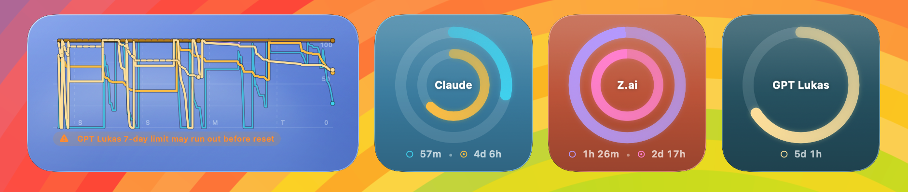
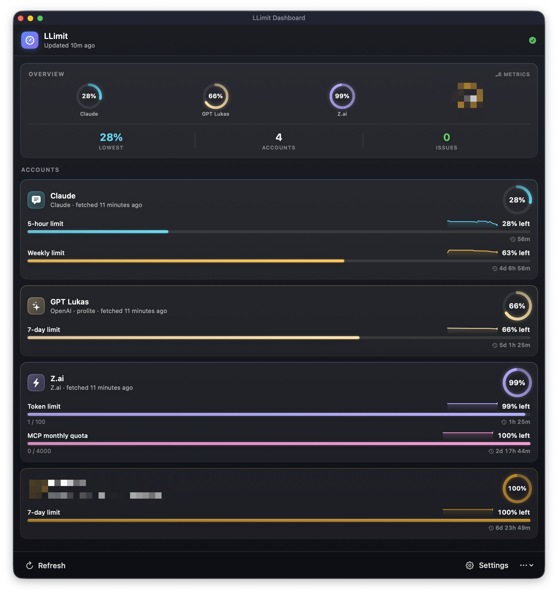

# LLimit

**LLimit** tracks how much of your LLM subscription quota is left:

> [!IMPORTANT]
> LLM disclosure: This codebase was written with substantial help from large language models: AI coding agents working from the [`AGENTS.md`](AGENTS.md) brief in this repo.

- **macOS** — a menu-bar app + desktop widgets.
- **Linux** — a headless `llimit` daemon + CLI, with ready-made status-bar modules
  (waybar, polybar, eww) and a `.deb` package.

**Latest release:** v<!-- version -->1.0.1<!-- /version --> · [Download](https://github.com/L-K-M/LLimit/releases/latest)
(macOS `.dmg`/`.zip` + Linux `llimit_*_amd64.deb`)



You manage your accounts **inside LLimit** — add as many as you like, including
several accounts for the same provider (e.g. two separate OpenAI accounts), each
tracked independently. Manual and imported accounts do not require the source tool
to remain installed. Optional managed Claude Code and Codex connections on macOS
use the installed official CLI to maintain each account's login.

To make setup painless, LLimit can **optionally detect** logins from AI tools you're
already signed in to (Claude Code, Codex, GitHub Copilot, Kimi, OpenCode, Devin, Muse Code) and import
them into a new account with one click — so for the common case you never hunt for a
token. You can always add accounts manually too.



## Linux quickstart

```bash
sudo dpkg -i llimit_*_amd64.deb                 # no Swift toolchain needed; static binary
llimit accounts import                          # detect local tool logins, or:
llimit accounts add --provider anthropic        #   add manually (prompts for the token)
systemctl --user enable --now llimit.service    # refresh daemon
llimit status                                   # human-readable
llimit status --json                            # the status-bar contract
```

Then point your bar at `llimit status --json` — drop-in modules for waybar, polybar
and eww live in [`Packages/LLimitd/examples/`](Packages/LLimitd/examples/) (and in
the .deb under `/usr/share/llimit/examples/`):


Everything in depth: [`Packages/LLimitd/README.md`](Packages/LLimitd/README.md).

## Quota alerts

Alerts are opt-in. On macOS, enable **Settings → Notifications → Quota Alerts**
and grant notification permission. Set ordered warning/critical bands there.
On Linux, use `llimit daemon --notify` or `--on-event <executable>`;
[`daemon options and hook payloads`](Packages/LLimitd/README.md#alerts) are documented separately.

Both platforms use QuotaCore's `QuotaEvents`: low quota (default 20%/5%),
observed resets after low windows, authentication/unreadable-usage failures,
recovery, and mostly unused weekly/monthly windows nearing reset. Thresholds
rearm after a five-point recovery or a fresh observation past the window end.
Carried or failing usage cannot trigger quota transitions; a timer alone cannot
confirm a reset. Notification copy excludes provider error messages and credentials.

macOS serializes permission, evaluation and persistence. Only accepted notification
requests latch; denied permission and failed delivery leave events retryable.
Linux records attempts before queued delivery for restart dedupe. Its state is
private (0600), atomically replaced and fsynced.

Integrated from [#110](https://github.com/L-K-M/LLimit/pull/110) (events/Linux hooks)
and [#100](https://github.com/L-K-M/LLimit/pull/100) (macOS settings/native notifications).

## Supported providers

The same providers work on both platforms. Managed Claude Code and Codex connections,
and Claude Keychain import, are macOS-only. Linux Claude Code writes
`~/.claude/.credentials.json` directly, which LLimit reads on both platforms.

| Provider | Credential it needs | One-click import from |
| --- | --- | --- |
| **Claude** (Anthropic) | OAuth access token | Claude Code (macOS Keychain / `~/.claude/.credentials.json`), OpenCode |
| **OpenAI / ChatGPT** | ChatGPT OAuth access token (+ account id) | Codex CLI (`~/.codex/auth.json`), OpenCode |
| **GitHub Copilot** | OAuth token, or PAT + username | `~/.config/github-copilot`, `~/.copilot`, OpenCode |
| **Zhipu AI** | API key | OpenCode (`zhipuai-coding-plan`) |
| **Z.ai** | API key | OpenCode (`zai-coding-plan`) |
| **Kimi** (Moonshot AI) | API key or OAuth access token | Kimi CLI (`~/.kimi`), Kimi Code (`~/.kimi-code`), OpenCode (`kimi-for-coding`) |
| **Google Antigravity** | Refresh token + project id | Antigravity IDE / CLI (`~/.gemini`), OpenCode (`antigravity-accounts.json`) |
| **Devin** (Cognition) | Session API key | Devin CLI (`~/.local/share/devin/credentials.toml`) |
| **Meta Muse** | Meta API key | Muse Code (`~/.config/muse/auth.json`) |
| **OpenCode Go** | API key for a Go subscription | OpenCode (`opencode-go` in `auth.json`) |
| **Venice** | API key; Admin key for reported daily DIEM allocation | Venice CLI (`~/.venice/config.json`), OpenCode (`venice` in `auth.json`) |
| **Cline** | API key | Cline (`~/.cline/data/settings/providers.json`, legacy `secrets.json`) |

For OpenCode Go, choose **Settings → Add Account → OpenCode Go** and enter your
OpenCode API key, or scan for a saved Go key. LLimit shows the rolling, weekly,
and monthly subscription limits and their server-provided reset times. Rings show
the rolling and monthly limits; the monthly limit uses the account's primary color.
The usage check does not generate tokens or consume model credits.

Go key import reads `opencode-go` entries in `$XDG_DATA_HOME/opencode/auth.json`
(default `~/.local/share/opencode/auth.json`), with `~/.config/opencode/auth.json`
as a compatibility fallback. If your OpenCode version stores credentials elsewhere,
add the API key manually. Imported accounts work without OpenCode running.

For Venice, choose **Settings → Add Account → Venice** and enter an API key from
[Venice API settings](https://venice.ai/settings/api), or import a saved Venice CLI
or OpenCode key. LLimit shows daily DIEM, USD, and bundled credit balances. An Admin
key also provides the daily DIEM allocation for rings, trend lines, and menu-bar
percentages. When that allocation is unavailable, LLimit estimates a daily upper
bound from the first positive balance, each balance increase, or the first balance
in a new server reset period. Later balances show a percentage against that bound,
marked as estimated. The first reading may already be partly spent. The bound
survives restarts and is cleared when you replace the key. A reported allocation
always takes precedence.
Bundled credits are USD-denominated balances; the API does not expose their total
allowance or reset date. This tracks API credits, not web-app message/image limits.
Polling only reads balances and does not make inference requests. Imported keys
work without Venice CLI or OpenCode running.

For Cline, choose **Settings → Add Account → Cline** and enter an API key from
[app.cline.bot](https://app.cline.bot/dashboard) under Account → API Keys, or import
a Cline CLI/extension login. Cline bills two ways and LLimit shows both. ClinePass,
the monthly subscription, reports rolling five-hour, weekly, and monthly limits with
their reset times. Cline credits, the pay-as-you-go balance, has no reported total
or reset, so it shows as an amount. Rings use the five-hour and weekly windows and
the monthly window takes the account's primary color. Polling only reads the
account API and never makes an inference request. Imported keys work without Cline
running; because LLimit does not renew Cline sessions, an expired one needs a fresh
import or a replacement key.

## How accounts work

- **Settings → Accounts** (macOS) / **`llimit accounts …`** (Linux) is where you
  add/rename/enable/remove accounts and enter credentials. Add the same provider
  multiple times for multiple subscriptions.
- Drag account rows in the macOS Settings sidebar to reorder them, or use their
  **Move Up** and **Move Down** context-menu commands. The menu-bar bars follow
  that order and use each account's primary color. Automatic widget assignments
  and account color variants stay stable when you reorder the rows.
- While Settings is open, LLimit appears in the Dock and Cmd-Tab so you can return
  after browser sign-in. Closing Settings restores its menu-bar-only behavior.
- **Detected on this machine** lists logins LLimit found locally; import creates a
  pre-filled account. This is just a shortcut — imported accounts are copied into
  LLimit and stored locally; the source tool can be removed.
- **Connect Claude** on macOS opens an embedded terminal for that account.
  Complete Claude Code's sign-in flow, then repeat for another account. Each login
  has a private profile, so your usual CLI login stays unchanged. Keep Claude Code
  installed for these managed connections: it handles login and token renewal.
- **Connect OpenAI** on macOS opens ChatGPT sign-in in your browser. Choose the
  account you want to track, then repeat for another subscription. Each account
  uses its own private Codex profile, separate from your usual Codex login. Keep
  Codex installed: it owns the credentials, renews them, and provides usage to
  LLimit through its app-server interface. Existing imported accounts stay separate
  until you explicitly connect them.
- Imported or manually entered Claude tokens are not replaced with whichever
  account is currently signed in to the CLI. If one expires, reconnect that account
  or explicitly import its updated credentials.
- Credentials are stored in LLimit's own settings file (mode `600`;
  `~/Library/Application Support/LLimit/` on macOS, `$XDG_CONFIG_HOME/LLimit/` on
  Linux) and are **redacted before anything is shared** with the widgets or the
  status-bar JSON — those only ever see usage numbers.
- Managed Claude profiles live under `~/Library/Application Support/LLimit/ClaudeProfiles/`
  with private directory permissions. Their refresh tokens remain in Claude Code's
  profile-specific Keychain or credential file. LLimit stores an access-token cache
  and account identity, and never stores Claude refresh tokens in its settings.
  Removing an account always removes its cached token from LLimit's settings.
  If renewal or cleanup is uncertain, LLimit keeps the local Claude login and
  reports that cleanup is pending. Reconnecting can also retain the previous login.
  Private records in `ClaudeProfiles/RetainedProfiles/` identify these namespaces;
  they are not imported, polled, or automatically deleted. Cleanup must first
  establish that no account references the profile and no process is using it.
- Managed Codex profiles use a separate `CODEX_HOME` under
  `~/Library/Application Support/LLimit/CodexProfiles/`. Codex stores credentials
  within each private profile. LLimit stores the profile reference and verified
  account identity, without copying Codex tokens into its settings or the widget
  store. Managed accounts are excluded from global credential imports and token
  renewal by LLimit. Exclusive operation records prevent two processes from
  opening the same profile. If LLimit exits during an operation whose outcome
  cannot be verified, reconnect the account to create a new login. Removing or
  reconnecting an account can retain an uncertain old profile, with a cleanup
  notice; these profiles are not automatically deleted or imported.
- Each account can have its own widget styling on macOS; on Linux the bar module
  shows every enabled account.
- The trend chart plots every enabled account. To declutter it, turn accounts
  off under **Trend Widget** in Settings; their tiles and dashboard rows remain.
- In an account's settings, **Primary color** sets the color of its longest limit
  in the ring and matching chart line. You can change it without enabling the
  background styling override, or choose **Reset to automatic** to restore the
  default window color. Other limits keep their existing colors.

## Requirements

**macOS**

- macOS 14+
- Xcode 16+ (only to build; releases run with no Xcode GUI)
- [XcodeGen](https://github.com/yonaskolb/XcodeGen)
- Claude Code installed for the optional managed Claude connection
- Codex CLI 0.144.4 or later installed for the optional managed OpenAI connection

**Linux**

- Any x86_64 distro for the release `.deb` (fully static binary; `systemd --user`
  for the daemon units, a bar that can run a command on an interval)
- Swift 6.2+ (only to build from source)

## Build & run (macOS)

```bash
brew install xcodegen      # if needed
xcodegen generate          # or: ./scripts/bootstrap.sh
open LLimit.xcodeproj
```

1. Select your Apple Developer **signing team** for both targets (`LLimit` and
   `LLimitWidgetExtension`). The App Group is `$(TeamIdentifierPrefix)group.ch.lkmc.llimit`.
2. Run the `LLimit` target — it lives in the menu bar (no Dock icon).
3. Add an account (manually, via **Import**, **Connect Claude**, or **Connect OpenAI**),
   then **Refresh Now**.
4. Add the widget from the desktop / Notification Center gallery.

The first time LLimit reads a Claude login from Keychain, macOS asks you to allow
access. Choose **Always Allow** to let background refreshes read that login.
Opening Settings does not scan credentials. Use **Scan** or Claude **Auto-fill**
to request an import; other providers' **Auto-fill** does not request Claude
Keychain access. Managed Claude accounts reuse their verified cached token until
it approaches expiry, unless a renewal is pending or authentication requires a
fresh profile check.
Explicit Claude renewals suppress the CLI's automatic startup authentication so
that startup renewal cannot race with the explicit exchange. Claude Code still performs
the exchange and stores the replacement in that account's private profile.
An account blocked by an earlier incomplete renewal must be reconnected once;
the update cannot safely reuse its possibly consumed refresh token.

## Build & run (Linux)

```bash
swift build --package-path Packages/LLimitd          # produces .build/debug/llimit
Packages/LLimitd/systemd/install.sh                  # binary + daemon unit into ~/.local
```

For the fully static release build and `.deb` packaging, see
[`Packages/LLimitd/README.md`](Packages/LLimitd/README.md#install-from-deb-no-swift-toolchain-needed).

## Build & release from the command line (no Xcode GUI)

```bash
./scripts/build.sh                # build LLimit.app (dev-signed so the widget works) + reveal in Finder
./scripts/build.sh --dmg --zip    # also package dist/LLimit-<version>.{dmg,zip}
./scripts/release.sh 0.3.0        # bump version, tag, push -> GitHub Actions publishes the release
```

See [`RELEASING.md`](RELEASING.md) for Developer ID signing + notarization and the
GitHub Actions setup. Pushing a `v*` tag builds and attaches the macOS
`.zip`/`.dmg` **and** the Linux `.deb` to a GitHub Release automatically.

## Why the app isn't sandboxed

The optional import feature reads credential files in your home directory and the
Claude Keychain item, which the App Sandbox blocks (or forces a "grant access" prompt
per file). LLimit is distributed directly rather than through the Mac App Store, so
the host app runs unsandboxed while the **widget extension stays sandboxed** and only
ever reads the shared App Group container. (No equivalent concern on Linux: there is
no sandbox, and the daemon reads the same XDG paths the AI tools use.) See
[`AGENTS.md`](AGENTS.md) for details.

## How it works

**macOS**

1. You configure accounts in LLimit (`QuotaCore.ProviderAccount`). `CredentialDiscovery`
   powers the optional import shortcut.
2. `QuotaCoordinator` fetches usage from each enabled account's provider API in parallel.
3. The result is written as a `QuotaSnapshot` JSON file into the App Group container
   (credentials are never included).
4. `WidgetCenter.reloadTimelines` nudges the widgets, which read the snapshot and render.

**Linux**

1. Same `QuotaCoordinator` + snapshot, driven by the `llimit` daemon (`llimit daemon`
   under `systemd --user`, or a timer) into `$XDG_DATA_HOME/LLimit/`.
2. Bars and scripts read it via `llimit status --json` — the credential-free contract
   the example waybar/polybar/eww modules consume.

The pure-Swift core (`Packages/QuotaCore`) and the Linux daemon (`Packages/LLimitd`)
are covered by unit tests that also run on Linux CI:

```bash
swift test --package-path Packages/QuotaCore
swift test --package-path Packages/LLimitd
```

The Ubuntu port's design and phased plan: [`UBUNTU_PORT.md`](UBUNTU_PORT.md).
